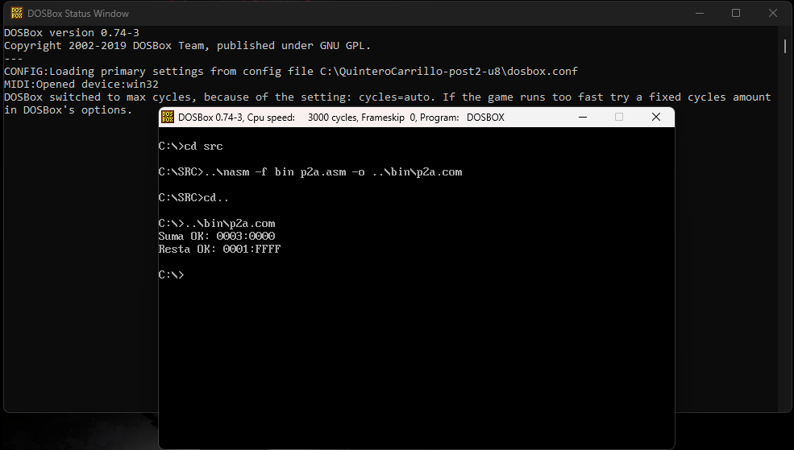
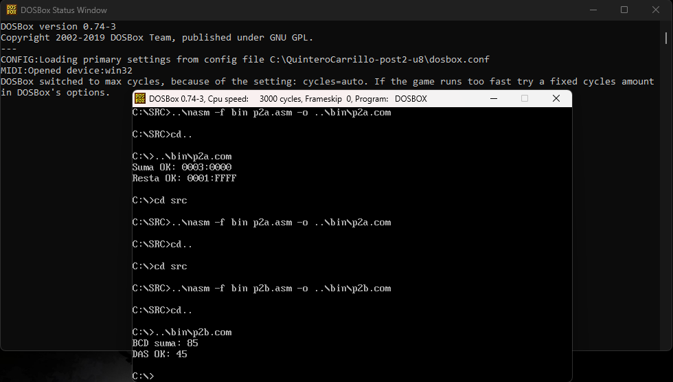
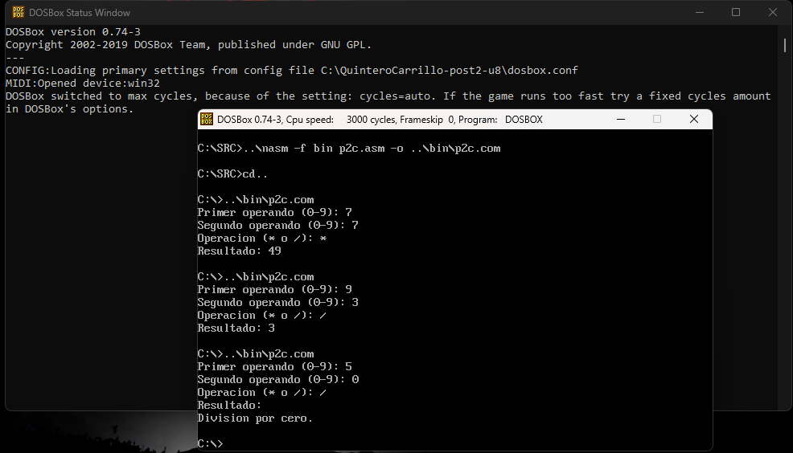

# Laboratorio Post-Contenido 2 — Aritmética
**Arquitectura de Computadores — Unidad 8**  
**Universidad Francisco de Paula Santander**  
**Ingeniería de Sistemas — 2026**  
**Estudiante:** Neidys Mariana Quintero Carrillo

---

## Descripción General

Este laboratorio implementa en NASM bajo DOSBox operaciones aritméticas
avanzadas en modo real x86 de 16 bits: precisión múltiple de 32 bits con
`ADC` y `SBB`, aritmética BCD empaquetada con `DAA` y `DAS`, y una mini
calculadora interactiva con `MUL` y `DIV` que incluye conversión
ASCII/binaria y manejo de división por cero.

---

## Estructura del Repositorio
```
QuinteroCarrillo-post2-u8/
├── src/
│   ├── p2a.asm   → Checkpoints 1-2: ADC suma 32 bits y SBB resta 32 bits
│   ├── p2b.asm   → Checkpoints 3-4: DAA suma BCD y DAS resta BCD
│   └── p2c.asm   → Checkpoint 5: calculadora MUL/DIV con conversión ASCII
├── bin/
│   ├── p2a.com
│   ├── p2b.com
│   └── p2c.com
├── capturas/
│   ├── cap1_adc_sbb_ok.png
│   ├── cap2_daa_das_ok.png
│   ├── cap3mul_div_divcero.png
│   
├── dosbox.conf
└── README.md
```
---

## Requisitos

- DOSBox 0.74-3
- NASM 2.07 (`nasm.exe` ubicado un nivel arriba de la carpeta del repo)
- Editor de texto plano (Notepad++)

## Compilación

Desde DOSBox, situarse en `C:\SRC>` y ejecutar:

```dos
..\nasm -f bin p2a.asm -o ..\bin\p2a.com
..\nasm -f bin p2b.asm -o ..\bin\p2b.com
..\nasm -f bin p2c.asm -o ..\bin\p2c.com
```

---

## Checkpoint 1 — Suma de 32 bits con ADC (`p2a.asm`)

### Descripción
En modo real de 16 bits, los números de 32 bits se almacenan en pares de
registros (`DX:AX`). La suma de dos números de 32 bits requiere dos pasos:
`ADD` para las partes bajas y `ADC` para las partes altas, propagando
automáticamente el acarreo `CF` generado por el `ADD`.

### Operación realizada
A = 0x0001FFFF  (DX=0001h, AX=FFFFh)
B = 0x00010001  (CX=0001h, BX=0001h)
─────────────────────────────────
ADD AX, BX → FFFFh + 0001h = 0000h, CF=1
ADC DX, CX → 0001h + 0001h + CF = 0003h
─────────────────────────────────
Resultado: DX:AX = 0003:0000h = 196608 decimal

### Registros involucrados
| Registro | Rol |
|----------|-----|
| `AX` | Parte baja del resultado |
| `DX` | Parte alta del resultado |
| `BX` | Parte baja del operando B |
| `CX` | Parte alta del operando B |
| `CF` | Acarreo propagado de ADD hacia ADC |

### Resultado
Suma OK: 0003:0000

---

## Checkpoint 2 — Resta de 32 bits con SBB (`p2a.asm`)

### Descripción
`SBB` (Subtract with Borrow) resta el operando fuente y el flag `CF`
(préstamo) al destino. Permite realizar restas de precisión múltiple
propagando el bit de préstamo desde la resta de las partes bajas hacia
las partes altas.

### Operación realizada
A = 0x00030000  (DX=0003h, AX=0000h)
B = 0x00010001  (CX=0001h, BX=0001h)
─────────────────────────────────
SUB AX, BX → 0000h - 0001h = FFFFh, CF=1 (préstamo)
SBB DX, CX → 0003h - 0001h - CF = 0001h
─────────────────────────────────
Resultado: DX:AX = 0001:FFFFh = 131071 decimal

### Registros involucrados
| Registro | Rol |
|----------|-----|
| `AX` | Parte baja del resultado |
| `DX` | Parte alta del resultado |
| `CF` | Préstamo (borrow) propagado de SUB hacia SBB |

### Resultado
Resta OK: 0001:FFFF

---

## Checkpoint 3 — Suma BCD con DAA (`p2b.asm`)

### Descripción
`DAA` (Decimal Adjust after Addition) corrige `AL` tras un `ADD` para
mantener el resultado en formato BCD empaquetado válido (dos dígitos
decimales por byte, un nibble por dígito). Verifica el nibble bajo y el
flag `AF` para determinar si suma 6 al nibble bajo, y luego verifica el
nibble alto y `CF` con el mismo criterio.

### Operación realizada
47h + 38h = 7Fh  ← binario puro (nibble bajo F > 9, inválido en BCD)
DAA             → AL = 85h  ← BCD correcto (47 + 38 = 85)

### Por qué es necesario DAA
Sin `DAA`, sumar `47h + 38h` produce `7Fh` que no es un valor BCD
válido (el nibble bajo `F` es mayor a 9). `DAA` detecta esto y suma
`6` al nibble bajo para "saltarse" los valores hexadecimales no
decimales (`A`-`F`), produciendo el resultado correcto `85h`.

### Resultado
BCD suma: 85

---

## Checkpoint 4 — Resta BCD con DAS (`p2b.asm`)

### Descripción
`DAS` (Decimal Adjust after Subtraction) corrige `AL` tras un `SUB`
para mantener el formato BCD. Opera de forma análoga a `DAA` pero
restando 6 cuando el nibble correspondiente produce un valor inválido
después de la resta binaria.

### Operaciones realizadas
Caso 1: 73h - 28h = 4Bh  ← nibble bajo B > 9, inválido
DAS → AL = 45h   ← BCD correcto (73 - 28 = 45)
Caso 2: 20h - 01h = 1Fh  ← nibble bajo F > 9, inválido
DAS → AL = 19h   ← BCD correcto (20 - 01 = 19)

### Resultado
DAS OK: 45

---

## Checkpoint 5 — Mini Calculadora MUL/DIV (`p2c.asm`)

### Descripción
Calculadora interactiva que lee dos dígitos (0-9) y un operador (`*` o
`/`) desde el teclado usando `INT 21h / AH=01h`. Convierte los
caracteres ASCII a binario restando `30h`, realiza la operación con
`MUL` o `DIV`, y convierte el resultado binario a decimal ASCII
mediante la subrutina `imprimirAX` (división repetida por 10 con
apilamiento de dígitos en la pila).

### Lógica de conversión ASCII ↔ binario
ASCII '7' = 37h  →  37h - 30h = 07h (binario)
Binario 56 = 38h →  38h / 10 = digitos '5' y '6' (ASCII)

### Instrucciones utilizadas
| Instrucción | Operación | Registros |
|-------------|-----------|-----------|
| `MUL CL` | `AX = AL * CL` sin signo | AL=operando A, CL=operando B |
| `DIV CL` | `AL = AX / CL`, `AH = resto` | AX=dividendo, CL=divisor |

### Manejo de división por cero
Antes de ejecutar `DIV`, se verifica `CL = 0` con `CMP CL, 0`.
Si el divisor es cero, se imprime el mensaje de error y se omite
la instrucción `DIV` para evitar la excepción de la CPU.

### Casos de prueba y resultados
7 * 7 → Resultado: 49
9 / 3 → Resultado: 3
5 / 0 → Division por cero.

---

## Capturas de Pantalla

### Checkpoint 1 y 2 — ADC suma y SBB resta 32 bits


### Checkpoint 3 y 4 — DAA suma BCD y DAS resta BCD


### Checkpoint 5 — Multiplicación 7×7=49  — División 9/3=3 — División por cero

